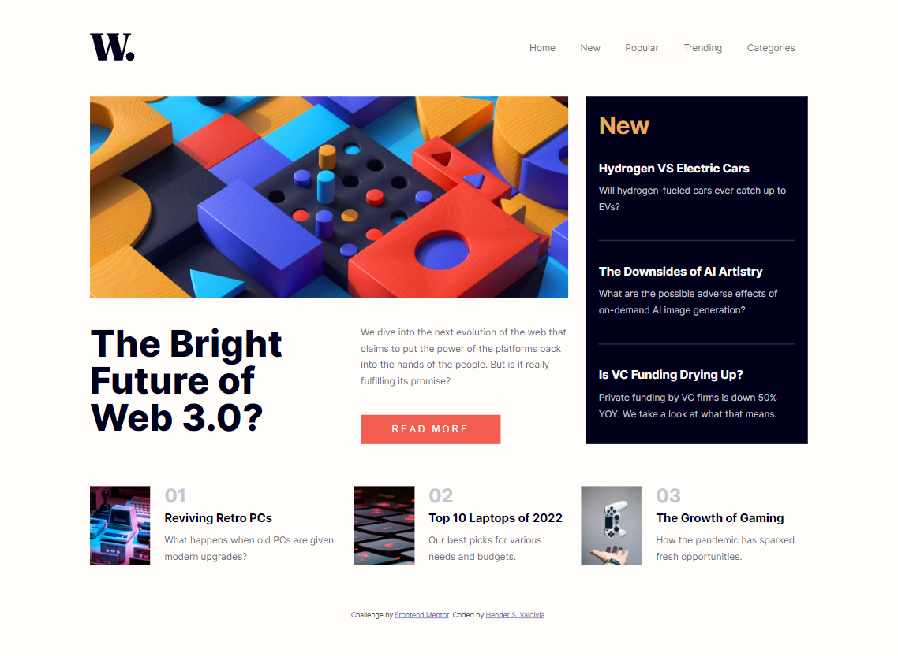

# Frontend Mentor - News homepage solution

This is a solution to the [News homepage challenge on Frontend Mentor](https://www.frontendmentor.io/challenges/news-homepage-H6SWTa1MFl). Frontend Mentor challenges help you improve your coding skills by building realistic projects. 

## Table of contents

- [Overview](#overview)
  - [Screenshot](#screenshot)
  - [Links](#links)
- [My process](#my-process)
  - [Built with](#built-with)
  - [What I learned](#what-i-learned)
  - [Continued development](#continued-development)
  - [Useful resources](#useful-resources)
- [Author](#author)

## Overview

### Screenshot



### Links

- Solution URL: [Github Repository](https://github.com/hendervm/news-homepage-main.git)
- Solution Live Site:[News Homepage](https://hendervm.github.io/news-homepage-main/)

## My process

### Built with

- Semantic HTML5 markup
- CSS Flexbox
- CSS Grid
- Mobile-first workflow
- Resposive Design
- Vanilla JavaScript

### What I learned

This is the first project I used Lighthouse to check code performance, really helpful tool when comparing two ways of doing anything, definitely going to keep using it.

Related to code performace a better way of having two different images for different viewport sizes is using a source tag with a srcset attribute, like the following code:
```
<picture class="main-poster">
  <source media="(min-width:992px)" srcset="assets\images\image-web-3-desktop.jpg">
  
</picture>
```
The code above not only saves us the CSS code, but also rendering two images instead of one in a very simple way.

### Continued development

Being careful with web performance is a skill that I can improve.

Semantic HTML is used in this, but anyways there are many more tags that could be useful for other projects.

### Useful resources

- [Responsive menu (mobile)](https://youtu.be/BqRkb_m_PuE) - This gave me the idea of using a checkbox for the mobile nav menu.

## Author

- Frontend Mentor - [@Shender04](https://www.frontendmentor.io/profile/Shender04)


